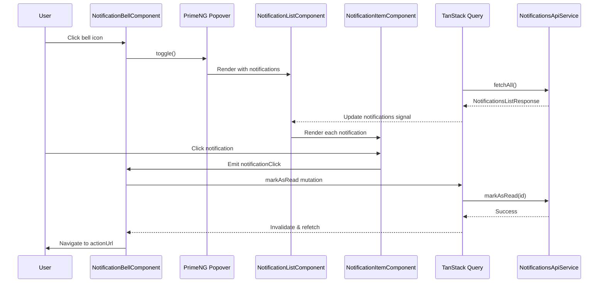
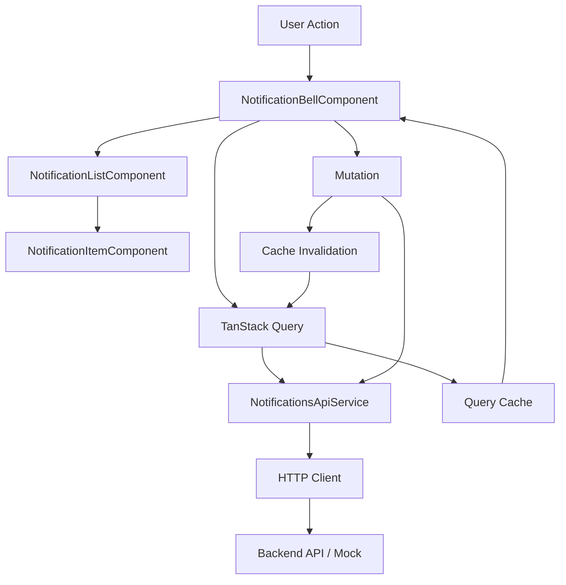

# Design Document: Notification Bell

## Overview

The notification bell feature adds a real-time notification system to the application's top bar. It consists of a bell icon button with a visual badge indicator and an overlay panel that displays a list of notification messages. The implementation follows Angular best practices using standalone components, signals for reactive state management, and PrimeNG components for the UI.

### Key Features

- Bell icon button in the top bar with unread count badge
- Popover panel displaying notification messages
- Message items showing sender, description (truncated at 150 chars), and timestamp
- Read/unread status tracking with visual indicators
- Responsive design for mobile and desktop views

## Architecture

### Component Structure

```
notification-bell/
├── notification-bell.component.ts       # Main bell button and popover container
├── notification-bell.models.ts          # TypeScript interfaces
├── notification-list.component.ts       # List of notification items
├── notification-item.component.ts       # Individual notification item
└── index.ts                             # Public API exports
```

### Data Layer

```
shared/data/notifications/
├── notifications.models.ts              # Domain models
├── notifications.queries.ts             # TanStack Query hooks
├── notifications-api.service.ts         # HTTP service
└── index.ts                             # Public API exports
```

### Integration Points

1. **Top Bar Component** (`src/app/shared/ui/layout/top-bar.component.ts`)
   - Replace existing static bell icon (lines 66-68 and 107-110)
   - Add `NotificationBellComponent` to imports
   - Add component to template

2. **Shared UI Module** (`src/app/shared/ui/index.ts`)
   - Export notification bell components

3. **Mock API** (optional for development)
   - Add notifications endpoints to `db.json` or mock interceptor

## Components and Interfaces

### 1. NotificationBellComponent

**Purpose:** Container component managing the bell icon, badge, and popover visibility.

**Template Structure:**
```html
<div class="relative">
  <button
    #bellButton
    (click)="togglePanel($event)"
    type="button"
    class="cursor-pointer relative p-2 -m-2 rounded-full"
    [attr.aria-label]="'Notifications (' + unreadCount() + ' unread)'"
    pRipple>
    <i class="pi pi-bell text-xl text-surface-600 dark:text-surface-300
       hover:text-surface-900 dark:hover:text-surface-100 transition-colors"></i>
    @if (unreadCount() > 0) {
      <p-badge
        [value]="badgeValue()"
        severity="danger"
        styleClass="absolute -top-1 -right-1" />
    }
  </button>

  <p-popover
    #popover
    [style]="{'width': '380px', 'max-height': '500px'}"
    [dismissable]="true">
    <ui-notification-list
      [notifications]="notifications()"
      (notificationClick)="onNotificationClick($event)"
      (markAllRead)="onMarkAllRead()" />
  </p-popover>
</div>
```

**State Management:**
- `notifications` - signal containing notification array
- `unreadCount` - computed signal from notifications
- `badgeValue` - computed signal (shows "99+" if > 99)
- `isOpen` - signal tracking popover visibility

**Methods:**
- `togglePanel(event)` - Shows/hides the popover
- `onNotificationClick(notification)` - Marks as read and navigates
- `onMarkAllRead()` - Marks all notifications as read

**Dependencies:**
- PrimeNG: `PopoverModule`, `BadgeModule`, `RippleModule`
- Services: TanStack Query for data fetching

### 2. NotificationListComponent

**Purpose:** Renders the list of notifications with header and empty state.

**Template Structure:**
```html
<div class="notification-list">
  <div class="flex items-center justify-between px-4 py-3 border-b border-surface-200 dark:border-surface-700">
    <h3 class="text-lg font-semibold text-surface-900 dark:text-surface-0">Notifications</h3>
    @if (hasUnread()) {
      <button
        (click)="markAllRead.emit()"
        class="text-sm text-primary-600 dark:text-primary-400 hover:underline">
        Mark all as read
      </button>
    }
  </div>

  <div class="overflow-y-auto max-h-[400px]">
    @if (notifications().length === 0) {
      <div class="py-12 text-center">
        <i class="pi pi-bell-slash text-4xl text-surface-300 dark:text-surface-600 mb-3"></i>
        <p class="text-surface-500 dark:text-surface-400">No notifications</p>
      </div>
    } @else {
      @for (notification of notifications(); track notification.id) {
        <ui-notification-item
          [notification]="notification"
          (click)="notificationClick.emit(notification)" />
      }
    }
  </div>
</div>
```

**Inputs:**
- `notifications: input.required<Notification[]>()`

**Outputs:**
- `notificationClick: output<Notification>()`
- `markAllRead: output<void>()`

**Computed Signals:**
- `hasUnread()` - derived from notifications array

### 3. NotificationItemComponent

**Purpose:** Displays individual notification with sender, message, timestamp, and read status.

**Template Structure:**
```html
<div
  [class]="
    'flex gap-3 px-4 py-3 cursor-pointer border-b border-surface-100 dark:border-surface-800 transition-colors ' +
    (notification().isRead
      ? 'bg-surface-0 dark:bg-surface-900 hover:bg-surface-50 dark:hover:bg-surface-800'
      : 'bg-primary-50 dark:bg-surface-800 hover:bg-primary-100 dark:hover:bg-surface-700')
  "
  [attr.aria-label]="notification().isRead ? 'Read notification' : 'Unread notification'"
  pRipple>

  <!-- Unread indicator dot -->
  @if (!notification().isRead) {
    <div class="flex-shrink-0 mt-1">
      <span class="h-2 w-2 bg-primary-500 rounded-full block"></span>
    </div>
  }

  <div class="flex-1 min-w-0">
    <div class="flex items-start justify-between gap-2 mb-1">
      <span class="font-semibold text-surface-900 dark:text-surface-0">
        {{ notification().senderName }}
      </span>
      <span class="text-xs text-surface-500 dark:text-surface-400 flex-shrink-0">
        {{ formattedTime() }}
      </span>
    </div>
    <p class="text-sm text-surface-600 dark:text-surface-300">
      {{ truncatedMessage() }}
    </p>
  </div>
</div>
```

**Inputs:**
- `notification: input.required<Notification>()`

**Computed Signals:**
- `truncatedMessage()` - Truncates description to 150 chars with ellipsis
- `formattedTime()` - Formats timestamp (relative for today, date otherwise)

**Time Formatting Logic:**
- Uses native `Intl.RelativeTimeFormat` for "X minutes ago"
- Falls back to `Intl.DateTimeFormat` for older dates

## Data Models

### Notification Interface

```typescript
export interface Notification {
  id: string;
  senderName: string;
  message: string;
  timestamp: Date | string;
  isRead: boolean;
  relatedEntityType?: 'user' | 'task' | 'comment' | 'system';
  relatedEntityId?: string;
  actionUrl?: string;
}
```

### API Response Types

```typescript
export interface NotificationsListResponse {
  items: Notification[];
  total: number;
  hasMore: boolean;
  unreadCount: number;
}

export interface MarkAsReadRequest {
  notificationIds: string[];
}
```

## Data Fetching Strategy

### TanStack Query Implementation

Following the existing pattern in `users.queries.ts`:

```typescript
// notifications.queries.ts
export const notificationsQuery = {
  list: listQuery,
  markAsRead: markAsReadMutation,
  markAllAsRead: markAllAsReadMutation,
};

function listQuery() {
  const notificationsApi = inject(NotificationsApiService);

  return injectQuery(() => ({
    queryKey: ['notifications', 'list'],
    queryFn: () => notificationsApi.fetchAll(),
    staleTime: 1000 * 30, // 30 seconds
    gcTime: 1000 * 60 * 5, // 5 minutes
    refetchInterval: 1000 * 60, // Poll every minute
  }));
}

function markAsReadMutation() {
  const notificationsApi = inject(NotificationsApiService);
  const queryClient = injectQueryClient();

  return injectMutation(() => ({
    mutationKey: ['markNotificationAsRead'],
    mutationFn: (notificationId: string) =>
      notificationsApi.markAsRead(notificationId),
    onSuccess: () => {
      queryClient.invalidateQueries({ queryKey: ['notifications'] });
    },
  }));
}
```

### API Service

```typescript
// notifications-api.service.ts
@Injectable({ providedIn: 'root' })
export class NotificationsApiService {
  private http = inject(HttpClient);
  private baseUrl = 'http://localhost:3000/notifications';

  fetchAll(): Promise<NotificationsListResponse> {
    return lastValueFrom(this.http.get<NotificationsListResponse>(this.baseUrl));
  }

  markAsRead(notificationId: string): Promise<void> {
    return lastValueFrom(
      this.http.patch<void>(`${this.baseUrl}/${notificationId}`, { isRead: true })
    );
  }

  markAllAsRead(): Promise<void> {
    return lastValueFrom(
      this.http.patch<void>(`${this.baseUrl}/mark-all-read`, {})
    );
  }
}
```

## Error Handling

### Query Error States

```typescript
// In NotificationBellComponent
notifications = notificationsQuery.list();

isLoading = computed(() => this.notifications.isLoading());
isError = computed(() => this.notifications.isError());
error = computed(() => this.notifications.error());
```

### Error Display Strategy

1. **Loading State:** Show skeleton/spinner in popover
2. **Error State:** Display error message with retry button
3. **Empty State:** Show "No notifications" message
4. **Network Errors:** Toast notification (using PrimeNG Toast)

### Mutation Error Handling

```typescript
onNotificationClick(notification: Notification) {
  if (notification.isRead) {
    this.navigateToAction(notification);
    return;
  }

  this.markAsReadMutation.mutate(notification.id, {
    onError: (error) => {
      // Show toast error
      console.error('Failed to mark as read:', error);
    },
    onSuccess: () => {
      this.navigateToAction(notification);
    },
  });
}
```

## Testing Strategy

### Unit Tests

**NotificationBellComponent:**
- ✓ Should display badge when unread count > 0
- ✓ Should hide badge when unread count = 0
- ✓ Should show "99+" when unread count > 99
- ✓ Should toggle popover on bell click
- ✓ Should mark notification as read on click
- ✓ Should navigate to action URL after marking as read
- ✓ Should emit ARIA live region updates for screen readers

**NotificationListComponent:**
- ✓ Should display empty state when no notifications
- ✓ Should render all notifications
- ✓ Should emit markAllRead event
- ✓ Should show "Mark all as read" button only when unread exist

**NotificationItemComponent:**
- ✓ Should truncate message at 150 characters
- ✓ Should append ellipsis when truncated
- ✓ Should format timestamp as relative for today
- ✓ Should format timestamp as date for past days
- ✓ Should show unread indicator dot when not read
- ✓ Should apply different background for unread items

### Integration Tests

- ✓ Should fetch notifications on component init
- ✓ Should update badge count after marking as read
- ✓ Should refetch notifications after mutations
- ✓ Should close popover when clicking outside
- ✓ Should handle API errors gracefully

### Accessibility Tests

- ✓ Keyboard navigation (Enter/Space to open, Esc to close)
- ✓ Focus trap within popover
- ✓ ARIA labels and live regions
- ✓ Screen reader announcements for badge updates

## Styling Approach

### PrimeNG Theme Integration

Using existing PrimeNG Aura theme with Indigo preset:
- Surface colors for backgrounds
- Primary colors for interactive elements
- Semantic color tokens (danger for badge)

### Tailwind CSS Classes

Following project conventions:
- Utility-first approach
- Dark mode with `.dark` class selector
- Responsive breakpoints (`lg:`)

### Custom Styles

Minimal custom CSS for:
- Smooth transitions
- Hover effects
- Scrollbar styling (if needed)

## Performance Considerations

### Virtual Scrolling

If notification list exceeds 50 items, implement PrimeNG VirtualScroller:

```html
<p-virtualScroller
  [value]="notifications()"
  [itemSize]="72"
  [style]="{'max-height': '400px'}">
  <ng-template let-notification #item>
    <ui-notification-item [notification]="notification" />
  </ng-template>
</p-virtualScroller>
```

### Query Optimization

- Stale time: 30 seconds (balance between freshness and requests)
- Refetch interval: 60 seconds (background polling)
- Cache time: 5 minutes
- Optimistic updates for mark-as-read mutations

### Change Detection

- OnPush change detection for all components
- Signals for reactive state (automatic change detection)
- Computed signals for derived values (memoized)

## Implementation Notes

### Existing Code Integration

**Top Bar Updates:**

Current bell icon implementation (desktop - line 107-110):
```html
<a class="cursor-pointer relative overflow-hidden p-2 -m-2 rounded-full" pRipple>
  <i class="pi pi-bell text-xl text-surface-600 dark:text-surface-300 hover:text-surface-900 dark:hover:text-surface-100 transition-colors"></i>
  <span class="absolute -top-1 -right-1 h-2 w-2 bg-red-500 rounded-full"></span>
</a>
```

Will be replaced with:
```html
<ui-notification-bell />
```

Similar replacement for mobile view (line 65-68).

### File Locations

Following Sheriff architecture rules:
- Components: `src/app/shared/ui/notification-bell/`
- Data services: `src/app/shared/data/notifications/`
- Models exported via barrel files (`index.ts`)

### Import Aliases

Use path aliases from `tsconfig.json`:
- `@my/ui` for UI components
- `@my/data` for data services

## Future Enhancements

### Phase 2 Considerations (Not in MVP)

1. **Real-time Updates:** WebSocket integration for instant notifications
2. **Notification Actions:** Inline actions (approve/deny) within items
3. **Filtering:** Filter by type/status
4. **Notification Preferences:** User settings for notification types
5. **Sound/Visual Alerts:** Audio cues and browser notifications
6. **Pagination:** Load more/infinite scroll for large lists
7. **Notification Groups:** Group related notifications

## Mermaid Diagrams

### Component Interaction Flow



### Data Flow Architecture


